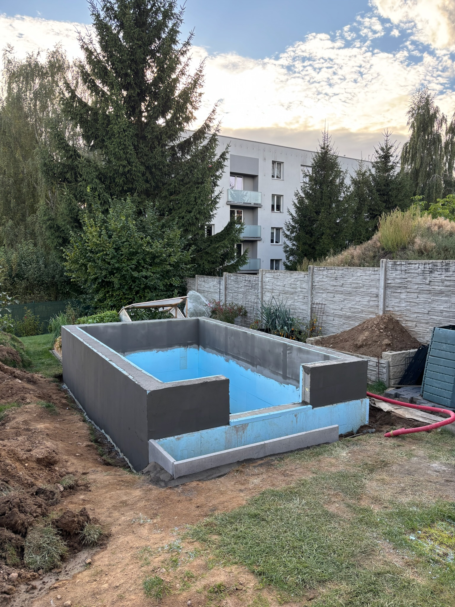

# gaht-greenhouse
Tak trochu jiný skleník – GAHT climate battery, Home Assistant automation and drip irrigation

# Tak trochu jiný skleník

Když se řekne skleník, většina lidí si představí konstrukci ze skla nebo polykarbonátu, několik záhonů, automatické otevírání oken a možná kapkovou závlahu.

Ten můj je trochu jiný.

Při stavbě jsem nechtěl řešit jen to, **jak ve skleníku udržet teplo**, ale také opačný problém – co s obrovským množstvím tepla, které vzniká během slunečných letních dnů. A jestli by se alespoň část tohoto tepla nedala uložit a později znovu využít.

Výsledkem je skleník využívající princip **GAHT – Ground to Air Heat Transfer**, doplněný o automatické řízení přes Home Assistant, vlastní senzory a kapkovou závlahu.

Nejde o klimatizovaný skleník ani o klasické vytápění. Celý princip je vlastně překvapivě jednoduchý:

**využít zeminu pod skleníkem jako obrovský tepelný akumulátor.**

---

## Základ skleníku

Skleník má vnější rozměry přibližně **3 × 5 metrů**. Vnitřní využitelný prostor je zhruba **2,7 × 4,6 m**.

Konstrukce je zasklená **4mm sklem** a záhony jsou přibližně **50 cm vysoké**. Jejich uspořádání připomíná písmeno **E**, takže zůstává dobrý přístup k rostlinám a současně se maximálně využívá plocha skleníku.

Důležitou součástí stavby je tepelná izolace. Podzemní část je izolována **XPS o tloušťce 5 cm**, a to z vnější i vnitřní strany. Smyslem není vytvořit dokonale izolovanou stavbu, ale omezit zbytečné tepelné ztráty zeminy, která v celém systému funguje jako akumulátor.

Ve skleníku je také **220litrový sud s vodou**, který kromě své hlavní funkce přidává další tepelnou setrvačnost.

   
  Fotografie stavby skleníku, základů a izolace XPS

---

# GAHT – klimatizace pomocí země

GAHT je zkratka pro **Ground to Air Heat Transfer**.

Princip samozřejmě není můj vynález. K celému projektu mě přivedl systém GAHT společnosti **Ceres Greenhouse Solutions**, která podobné systémy označuje také jako *Climate Battery*.

Původní inspiraci a princip systému lze najít zde:

**[Ceres Greenhouse Solutions – GAHT System](https://ceresgs.com/gaht-system/)**

Můj skleník není kopií jejich konkrétního řešení. Princip jsem si přizpůsobil velikosti domácího skleníku, místním podmínkám a samozřejmě také své potřebě všechno měřit, připojit do Home Assistantu a automatizovat. :-)

---

## Jak je GAHT postavený

Pod skleníkem je vytvořen systém vzduchových trubek. Ventilátor může nasávat vzduch z horní části skleníku, protlačit jej podzemním potrubím a následně jej vrátit zpět do skleníku.

A právě zemina kolem potrubí funguje jako výměník a zároveň jako zásobník tepla.

Hlavní vstupní a výstupní potrubí má průměr **200 mm**. Pod zemí se proud vzduchu rozděluje do **pěti paralelních větví o průměru 100 mm**, přičemž každá má délku přibližně **10 metrů**.

Celkem je tedy pod skleníkem uloženo přibližně **50 metrů potrubí**, přes jehož stěny dochází k výměně tepla mezi proudícím vzduchem a okolní zeminou.

Potrubí je uloženo přibližně **1 metr pod pochozí úrovní skleníku**. Nad ní jsou ještě 50 cm vysoké vyvýšené záhony.

Teplotní čidlo zeminy je přibližně ve stejné hloubce jako potrubí, ale asi **20 cm stranou od něj**. Neměřím tedy teplotu samotného potrubí ani vzduchu, který jím právě proudí, ale skutečnou teplotu okolní zemní masy.

Nasávání vzduchu je umístěno nahoře, kde se přirozeně hromadí nejteplejší vzduch. Výstup systému je na opačné straně skleníku.

> 📷 *Pokládka pěti větví podzemního potrubí – 5 × 10 metrů Ø100 mm.*

---

# Země jako tepelná baterie

Celý princip GAHT se dá zjednodušit na jednu myšlenku:

**Když mám tepla příliš mnoho, uložím ho do země. Když ho mám málo, vezmu si část zpět.**

Ve slunečný den se vzduch ve skleníku dokáže ohřát velmi rychle. Ventilátor nasává nejteplejší vzduch z horní části skleníku a žene ho podzemním výměníkem.

Vzduch předává energii okolní zemině a do skleníku se vrací chladnější.

V noci může celý proces fungovat opačně. Pokud je zemina teplejší než vzduch ve skleníku, proudící vzduch z ní část energie odebere a vrátí ji zpět do prostoru skleníku.

Není to perpetuum mobile ani tepelné čerpadlo. Ventilátor žádné teplo nevyrábí.

**Pouze přesouvá energii mezi vzduchem a zemí.**

---

# Březen – nabíjení přes den, vybíjení v noci

Teorie je jedna věc, ale mnohem zajímavější je podívat se na skutečná data z Home Assistantu.

Následující graf zachycuje několik chladných dnů na začátku března.

- **žlutá** – teplota vzduchu ve skleníku
- **červená** – venkovní teplota
- **modrá** – teplota zeminy

Během prvních tří dnů je GAHT aktivní.

Přes den slunce velmi rychle ohřívá vzduch ve skleníku, v některých okamžicích až nad **30 °C**. Ventilátor v této chvíli žene teplý vzduch podzemním výměníkem a část přebytečné energie se ukládá do zeminy.

Na modré křivce je dobře vidět, jak se během dne mění gradient teploty zeminy a její teplota začne znovu růst.

Po západu slunce se situace obrátí.

Venkovní teplota rychle klesá. GAHT nyní využívá energii uloženou během dne. Chladnější vzduch ze skleníku prochází teplejší zeminou a vrací se zpět ohřátý.

Na modré křivce je tento okamžik pěkně vidět jako **zrychlení poklesu teploty zeminy** – zemní baterie se vybíjí. Současně začne růst teplota vzduchu ve skleníku.

Poslední den grafu je záměrně jiný.

**Ventilátor GAHT jsem vypnul, abych mohl porovnat chování skleníku bez aktivního přenosu tepla.**

Zemina zůstává bez aktivního proudění vzduchu podstatně klidnější a její teplota klesá jen pomalu.

Právě tento graf podle mě nejlépe vystihuje celý princip GAHT:

**Přes den nabít. V noci část energie zase využít.**

---

# Jaro – nejde jen o teplotu vzduchu

Na začátku sezóny pro mě není důležitá jen teplota vzduchu. Stejně zajímavé je, co se během týdnů děje s obrovskou masou zeminy pod skleníkem.

V běžném skleníku dokáže první jarní slunce během několika hodin vytvořit ve vzduchu téměř letní teplotu, zatímco hlubší vrstvy půdy jsou stále studené po zimě.

U GAHT se snažím tento přebytek energie využít.

Potrubí je přibližně **1 metr pod pochozí úrovní** a záhony jsou dalších **50 cm nad ní**. Od výměníku ke kořenové zóně je tedy poměrně dlouhá cesta.

Kořeny rostlin proto neohřívám přímo.

Během slunečných dnů postupně ukládám energii hluboko do podloží. Zemina se neohřeje během jednoho odpoledne a stejně tak se teplo okamžitě nedostane ke kořenům.

Celý proces je pomalý.

**To je ale zároveň jeho výhoda.**

Postupným nabíjením podloží během dalších a dalších slunečných dnů se vytváří velký tepelný zásobník. Teplo se z něj pomalu šíří okolní zeminou, mimo jiné i směrem vzhůru k záhonům.

Stejně pomalu, jako se tato masa zeminy ohřívá, také následně vychládá.

Výsledkem je, že na začátku sezóny nezačínám s promrzlou půdou, která pouze čeká, až ji během dalších týdnů prohřeje jarní slunce.

GAHT tak neovlivňuje jen teplotu vzduchu, ale postupně mění **tepelný režim celého podloží skleníku**.

A právě stabilnější a teplejší půda dává kořenovému systému rostlin na jaře lepší start.

---

# Duben – když venku mrzne

O měsíc později už není hlavním cílem jen experimentovat s ukládáním tepla. Ve skleníku začíná být důležité udržet během chladných nocí teplotu nad bodem mrazu.

Na grafu je několik nocí, během kterých venkovní teplota klesá **pod 0 °C**, zatímco uvnitř skleníku se daří držet teplotu nad bodem mrazu.

Modrá křivka současně ukazuje, odkud se potřebná energie bere.

Zemina zůstává výrazně teplejší než okolní vzduch a při aktivním GAHT postupně předává část naakumulovaného tepla zpět do skleníku.

Právě na jaře pro mě začíná dávat celý koncept největší smysl.

Přes den ukládám přebytečnou sluneční energii do země, v noci můžu její část využít a současně se během dalších týdnů postupně prohřívá celé podloží pod záhony.

---

# Červenec – a teď přesně naopak

V létě se problém úplně obrátí.

Tepla není málo.

Je ho **příliš mnoho**.

Za slunečného červencového dne začne teplota vzduchu ve skleníku velmi rychle stoupat. Jakmile překročí nastavenou hranici, spustí se GAHT a začne hnát horký vzduch přes 50 metrů potrubí uloženého v chladnější zemině.

Na grafu je tento okamžik velmi dobře vidět.

Žlutá křivka nejprve prudce stoupá, ale po spuštění ventilátoru se její růst zastaví a po poměrně dlouhou dobu vytváří charakteristickou **„polici“ kolem 28–30 °C**.

GAHT v této chvíli odvádí část tepla ze vzduchu do zeminy.

Současně lze na modré křivce sledovat opačný efekt – **teplota zeminy pomalu roste**.

Energie nezmizela. Jen jsem ji přesunul z místa, kde jí mám příliš mnoho, do tepelné kapacity země pod skleníkem.

V nejteplejší části dne už samozřejmě ani zemní výměník nedokáže pohltit všechnu přicházející energii a objeví se krátká teplotní špička. Následně začne výkon slunce klesat a s ním klesá i teplota skleníku.

GAHT tedy není klimatizace v klasickém slova smyslu a jeho cílem není udržovat přesných 25 °C.

**Pomáhá ale výrazně tlumit rychlý nástup vysokých teplot a ořezávat jejich špičky.**

Na jaře používám zem jako zdroj tepla.

V létě jako jeho zásobník.

---

# Skleník si o ventilaci rozhoduje sám

Samotný zemní výměník by bez řízení nebyl příliš užitečný. Proto je GAHT zapojený do mého **Home Assistantu**.

Ve skleníku sleduji mimo jiné:

- teplotu vzduchu,
- teplotu zeminy,
- vlhkost,
- stav a chod ventilace,
- a další provozní hodnoty.

Část senzoriky je postavena na **ESPHome**, takže jsou hodnoty přímo dostupné v Home Assistantu.

O vlastní rozhodování se stará automatizace v **Node-RED**.

Logika je záměrně poměrně jednoduchá.

## Chlazení

Pokud teplota vzduchu ve skleníku dosáhne přibližně **24 °C**, GAHT se zapne a začne ukládat přebytečné teplo do zeminy.

Po poklesu teploty přibližně na **22 °C** se vypne.

Používám tedy hysterezi, aby ventilátor nereagoval na každou desetinu stupně a zbytečně necykloval.

## Ohřev

U nízkých teplot je rozhodování trochu složitější.

Pokud teplota vzduchu ve skleníku klesne přibližně na **10 °C**, nestačí jednoduše zapnout ventilátor. Automatizace nejprve kontroluje, zda má vůbec smysl energii ze země odebírat.

GAHT se proto spustí pouze tehdy, pokud je zemina dostatečně teplá.

Po zvýšení teploty vzduchu přibližně na **11 °C** se systém opět vypne.

Automatizace navíc používá **minimální dobu běhu 10 minut**, aby ventilátor zbytečně často nespínal.

Řízení rozlišuje také zimní a letní část roku, protože požadované chování systému je v různých částech sezóny odlišné.

> 📷 *Screenshot Node-RED flow.*

---

# Home Assistant jako centrální bod

Home Assistant zde není jen hezký dashboard.

Dává mi možnost vidět, **co se ve skleníku skutečně děje v čase**.

Samotná okamžitá teplota totiž mnoho neřekne. Zajímavé začnou být až grafy.

Je na nich možné sledovat:

- jak rychle roste teplota po východu slunce,
- kdy se spustil GAHT,
- jak reagovala teplota vzduchu,
- jak se postupně mění teplota zeminy,
- jak dlouho systém běžel,
- a co se dělo během noci.

A právě dlouhodobá data jsou pro další ladění systému mnohem cennější než pocit, že „dnes tam bylo docela teplo“.

---

# A když už automatizovat, tak i vodu

Druhou věcí, kterou jsem ve skleníku nechtěl každý den řešit ručně, je zalévání.

Proto je součástí systému **kapková závlaha**.

U rajčat, paprik nebo okurek má kapková závlaha několik výhod. Voda jde přímo ke kořenům, zbytečně se nenamáčí listy a množství vody lze dávkovat podstatně přesněji než při klasickém zalévání konví.

Také zde je výhoda propojení s automatizací. Zavlažování nemusí být izolovaný systém s obyčejnými spínacími hodinami. Home Assistant ví, kdy se zalévalo, jak dlouho závlaha běžela a celý systém lze dál rozšiřovat o informace ze senzorů.

> 📷 *Detail kapkové závlahy a záhonů během sezóny.*

---

# Kolik to celé stojí?

Tohle bude pravděpodobně jedna z prvních otázek každého, kdo začne uvažovat, že by něco podobného postavil.

Přesnou ekonomickou návratnost jsem nikdy nepočítal a ani to nebylo cílem projektu. Do nákladů navíc vůbec nepočítám vlastní práci a čas strávený stavbou, zapojováním a postupným laděním celého systému.

Největší část rozpočtu přitom netvořil samotný GAHT.

Významnou položkou byly především **stavební práce, základy a konstrukce potřebná pro vyvýšený skleník a vyvýšené záhony**.

Samotné podzemní potrubí GAHT tvořilo ve srovnání s cenou celé stavby jen zlomek nákladů. Stejně tak ventilátor, senzory, elektronika a řízení přes Home Assistant představují v celkovém rozpočtu skleníku spíše minoritní položky.

Jinými slovy – pokud už člověk skleník staví a má možnost GAHT připravit během zemních a stavebních prací, není samotný systém tím, co z projektu udělá zásadně dražší stavbu.

Největší investice je pořád **skleník samotný**.

A ekonomická návratnost?

Domácí skleník se podle mě ekonomicky nezaplatí skoro nikdy. Pokud bych do ceny rajčete započítal stavbu, technologie a svůj čas, pravděpodobně bych pěstoval jedny z nejdražších rajčat v České republice. :-)

Ale o to vlastně nejde.

Je to koníček, radost z vlastní zeleniny a v mém případě zároveň technický projekt, na kterém si můžu hrát s automatizací, elektronikou, měřením a fyzikou.

---

# A provozní náklady?

Tady už je situace velmi jednoduchá.

Celý přenos tepla zajišťuje v podstatě jediná aktivní součást – **ventilátor s příkonem přibližně 90 W**.

Podle délky jeho provozu se spotřeba pohybuje řádově kolem **1 kWh za den** v době, kdy je GAHT intenzivně využíván.

Za tuto energii přitom nedostávám teplo vyrobené elektřinou.

Elektřina pouze pohání vzduch.

Samotnou tepelnou energii dodává slunce a zemina funguje jako její akumulátor.

**90W ventilátor tedy pouze rozhoduje o tom, kam se energie, kterou už ve skleníku mám, právě přesune.**

---

# Co mi to celé přineslo?

Výsledkem není skleník, ve kterém je celý rok konstantních 22 °C. Fyziku samozřejmě obejít neumí.

GAHT ale pomáhá řešit tři věci, které mě při stavbě zajímaly nejvíc:

**V létě** tlumí prudký nárůst teploty a část přebytečné energie ukládá do země.

**Během chladných jarních nocí** dokáže část energie ze země vrátit zpět a pomáhá udržovat příznivější teplotu ve skleníku.

A možná nejzajímavější je **dlouhodobý vliv na samotnou půdu**. Během jara postupně nabíjím velkou masu zeminy hluboko pod záhony. Ta má obrovskou tepelnou setrvačnost a získanou energii udržuje podstatně déle než vzduch ve skleníku.

Kořeny tedy nevyhřívám přímo.

Snažím se vytvořit **tepelně stabilnější prostředí celého skleníku – od hlubokého podloží přes záhony až po vzduch kolem rostlin.**

---

# Co dál?

Celý skleník beru spíš jako dlouhodobý projekt než jako hotovou věc.

Home Assistant umožňuje ukládat data, porovnávat jednotlivé sezóny a podle nich upravovat řízení ventilace.

Postupně tak lze hledat odpovědi na mnohem zajímavější otázky než jen „kolik je právě ve skleníku stupňů“.

Například:

**Kolik energie dokáže zemina během dne skutečně absorbovat?**

**Jak dlouho ji dokáže udržet?**

**O kolik GAHT sníží maximální letní teplotu?**

**Jak velký vliv má na teplotu půdy na začátku sezóny?**

**A o kolik dokáže prodloužit pěstitelskou sezónu?**

Právě proto vznikl i tento GitHub.

Ne jako univerzální návod na stavbu skleníku, který je potřeba přesně okopírovat, ale jako dokumentace jednoho experimentu, který spojuje **zahradničení, fyziku, elektroniku a domácí automatizaci**.

A protože se v něm stále něco měří, upravuje a vylepšuje, je dost pravděpodobné, že ani tahle dokumentace nebude nikdy úplně hotová.

# Tak trochu jiný skleník 🌱
