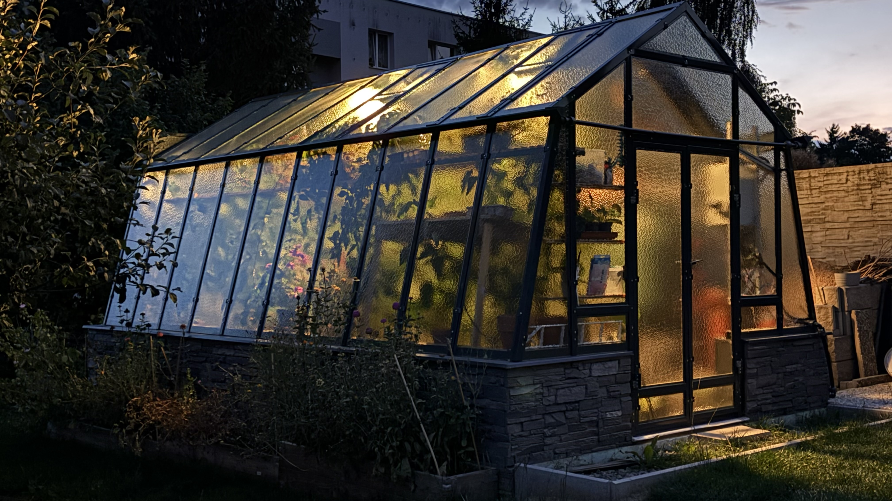
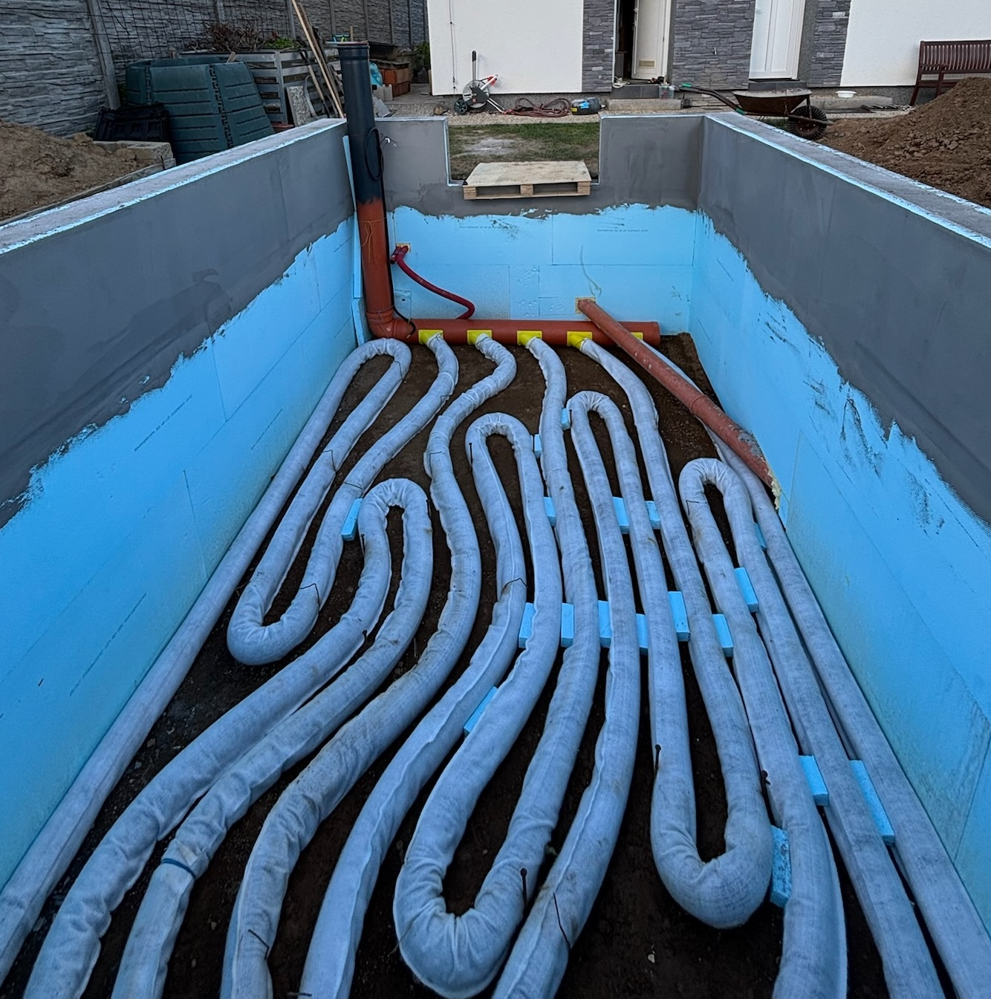
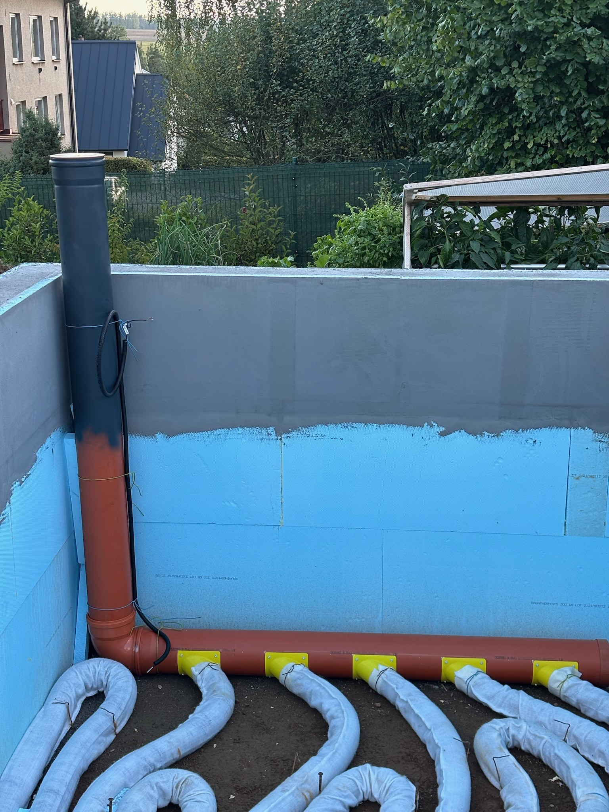
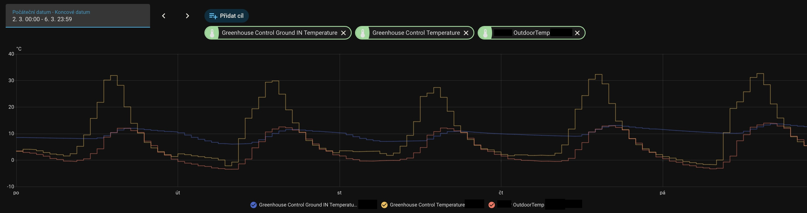
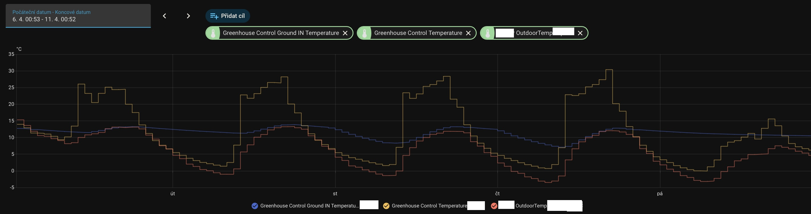
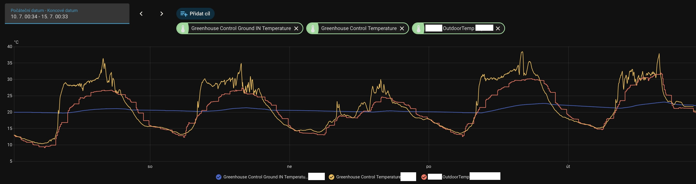
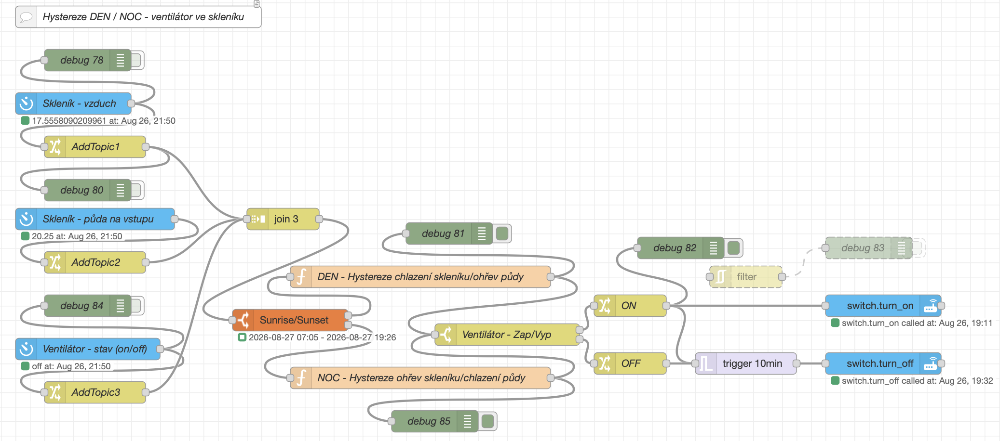
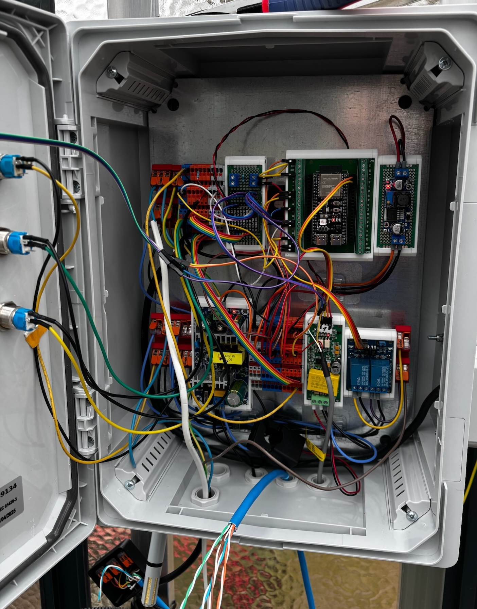
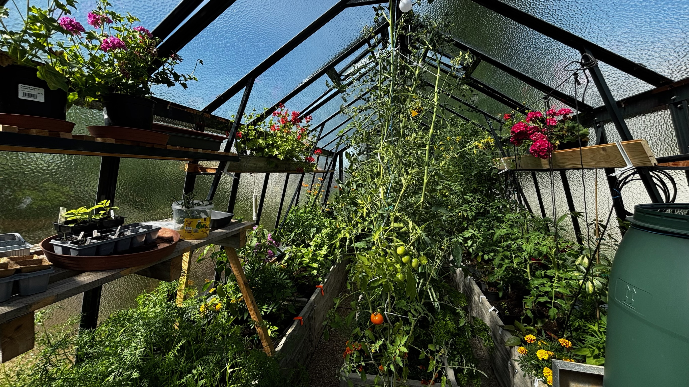

[🇨🇿 Česky](README.md) · [🇬🇧 English](README_EN.md)
# gaht-greenhouse
A Different Kind of Greenhouse – GAHT climate battery, Home Assistant automation and drip irrigation

   
   

# A Different Kind of Greenhouse

When people think of a greenhouse, they usually picture a glass or polycarbonate structure, a few growing beds, automatic window openers and perhaps some drip irrigation.

Mine is a little different.

When I built it, I wasn't only thinking about **how to keep the greenhouse warm**. I was also interested in the opposite problem – what to do with the huge amount of excess heat that builds up inside on sunny summer days. And whether at least some of that energy could be stored and used again later.

The result is a greenhouse based on the **GAHT – Ground to Air Heat Transfer** principle, combined with automatic control through Home Assistant, my own sensors and drip irrigation.

It isn't an air-conditioned greenhouse, nor does it use conventional heating. The basic idea is actually surprisingly simple:

**use the ground beneath the greenhouse as a huge thermal battery.**

---

## The greenhouse itself

The greenhouse measures approximately **3 × 5 metres** externally, with a usable interior space of around **2.7 × 4.6 m**. It is located in the Vysočina Region of the Czech Republic at an elevation of approximately **470 metres above sea level**, where colder nights are common, especially at the beginning and end of the growing season.

The structure is glazed with **4 mm glass**, and the raised beds are approximately **50 cm high**. They are arranged roughly in the shape of the letter **E**, providing good access to the plants while making efficient use of the available space.

Thermal insulation was also an important part of the construction. The underground section is insulated with **5 cm XPS**, both from the outside and the inside. The idea isn't to create a perfectly insulated structure, but to reduce unnecessary heat loss from the mass of soil that acts as the thermal store for the entire system.

There is also a **220-litre water barrel** inside the greenhouse which, besides its primary purpose, adds a little more thermal mass.

   
   
  Greenhouse construction, foundations and XPS insulation

---

# GAHT – using the ground for climate control

GAHT stands for **Ground to Air Heat Transfer**.

The principle itself is obviously not my invention. The original inspiration for this project came from the GAHT system developed by **Ceres Greenhouse Solutions**, which also refers to this type of system as a *Climate Battery*.

You can find the original concept and more information here:

**[Ceres Greenhouse Solutions – GAHT System](https://ceresgs.com/gaht-system/)**

My greenhouse isn't a copy of their specific implementation. I adapted the basic principle to the size of a home greenhouse, my local conditions and, of course, my need to measure everything, connect it to Home Assistant and automate it. :-)

---

## How my GAHT system is built

Underneath the greenhouse is a network of perforated air pipes. A fan draws air from the upper part of the greenhouse, pushes it through the underground pipework and returns it back into the greenhouse.

The soil surrounding the pipes acts both as a heat exchanger and as a thermal store.

GAHT also has another interesting side effect – it helps reduce humidity inside the greenhouse. As warm, humid air passes through the cooler underground pipes, it cools down and some of the water vapour can condense. The distribution pipes are **perforated**, allowing this condensate to drain directly into the surrounding soil instead of collecting inside the pipes.

This means that some of the water evaporated from the beds and plants into the greenhouse air can eventually find its way back into the soil through the GAHT system. So besides transferring heat, the system also helps manage humidity inside the greenhouse.

The main inlet and outlet pipes have a diameter of **200 mm**. Underground, the airflow is divided into **five parallel 100 mm branches**, each approximately **10 metres long**.

That gives me a total of around **50 metres of underground pipework**, through which heat is exchanged between the moving air and the surrounding soil.

The pipes are buried approximately **1 metre below the greenhouse floor level**. On top of that are the raised beds, another 50 cm high.

The soil temperature sensor is installed at roughly the same depth as the pipes, but about **20 cm to the side**. So it doesn't measure the temperature of the pipe itself, or the air currently flowing through it – it measures the actual temperature of the surrounding soil mass.

The air intake is located high up in the greenhouse, where the warmest air naturally collects. The outlet is located on the opposite side.

   
  
  
   
  Installing the five underground branches – 5 × 10 metres of Ø100 mm pipe

---

# The ground as a thermal battery

The whole GAHT concept can be reduced to one simple idea:

**When I have too much heat, I store it in the ground. When I don't have enough, I take some of it back.**

On a sunny day, the air inside a greenhouse can heat up very quickly. The fan draws the hottest air from the top of the greenhouse and pushes it through the underground heat exchanger.

The air transfers energy to the surrounding soil and returns to the greenhouse cooler.

At night, the process can work the other way around. If the soil is warmer than the greenhouse air, the moving air picks up some of that stored energy and brings it back into the greenhouse.

This isn't perpetual motion, and it isn't a heat pump. The fan doesn't generate any heat.

**It simply moves energy between the air and the ground.**

---

# March – charging by day, discharging by night

Theory is one thing, but looking at real data from Home Assistant is much more interesting.

The following graph shows several cold days at the beginning of March.

- **yellow** – greenhouse air temperature
- **red** – outdoor temperature
- **blue** – soil temperature

   
   
  GAHT operation in March

During the first three days, GAHT is active.

During the day, the sun heats the greenhouse air very quickly, sometimes to over **30 °C**. At this point, the fan pushes the warm air through the underground heat exchanger and some of the excess energy is stored in the soil.

The blue curve clearly shows how the soil temperature gradient changes during the day and the temperature begins to rise again.

After sunset, the situation reverses.

The outdoor temperature drops quickly. GAHT can now make use of some of the energy stored during the day. Cooler greenhouse air passes through the warmer soil and returns to the greenhouse at a higher temperature.

This is nicely visible on the blue curve as an **accelerated drop in soil temperature** – the thermal battery is being discharged. At the same time, the greenhouse air temperature starts to rise.

The final day in the graph is deliberately different.

**I switched the GAHT fan off so I could compare how the greenhouse behaves without active heat transfer.**

Without forced airflow, the soil temperature remains much more stable and drops only slowly.

For me, this graph probably demonstrates the basic GAHT principle better than anything else:

**Charge it during the day. Use some of that energy again at night.**

---

# Spring – it's not just about air temperature

At the beginning of the growing season, air temperature isn't the only thing I'm interested in. What happens over the course of several weeks to the huge mass of soil underneath the greenhouse is just as important.

In a conventional greenhouse, the first spring sunshine can create almost summer-like air temperatures within a few hours, while the deeper layers of soil are still cold from winter.

With GAHT, I try to make use of that excess energy.

The pipework is approximately **1 metre below floor level**, while the raised beds extend another **50 cm above it**. So there is quite a long way between the underground heat exchanger and the root zone.

I'm therefore not heating the plant roots directly.

During sunny days, I gradually store energy deep in the ground. The soil doesn't warm up in a single afternoon, and the heat doesn't immediately reach the roots either.

The whole process is slow.

**But that's also one of its advantages.**

By repeatedly charging the ground on sunny days, a large thermal store gradually builds up beneath the greenhouse. Heat slowly spreads through the surrounding soil, including upwards towards the raised beds.

And just as this large mass of soil takes time to warm up, it also takes a long time to cool down again.

The result is that at the beginning of the season I'm not starting with frozen ground that simply has to wait several weeks for the spring sun to warm it naturally.

GAHT therefore doesn't only affect the air temperature. Over time, it changes the **thermal behaviour of the entire mass of soil beneath the greenhouse**.

And that more stable, warmer soil gives the plants' root systems a better start in spring.

---

# April – when it's freezing outside

A month later, simply experimenting with heat storage is no longer the main goal. During cold spring nights, keeping the greenhouse above freezing becomes much more important.

   
   
  GAHT operation in April

The graph shows several nights when the outdoor temperature drops **below 0 °C**, while the greenhouse remains above freezing.

At the same time, the blue curve shows where the required energy is coming from.

The soil remains significantly warmer than the outside air and, with GAHT running, gradually releases some of its stored heat back into the greenhouse.

This is where the whole concept really starts to make sense to me in spring.

During the day I store excess solar energy in the ground. At night I can use some of it again, while over the following weeks the entire mass of soil beneath the raised beds gradually warms up.

---

# July – now the exact opposite

In summer, the problem is completely reversed.

There isn't too little heat.

There is **far too much of it**.

On a sunny July day, the greenhouse air temperature starts rising very quickly. Once it reaches the configured threshold, GAHT starts and pushes the hot air through 50 metres of pipe buried in the cooler soil.

   
   
  GAHT operation in summer

You can see this very clearly in the graph.

The yellow curve initially rises sharply, but once the fan starts, the rise stops and the temperature forms a characteristic **plateau around 28–30 °C** for quite a long time.

At this point, GAHT is transferring some of the heat from the air into the ground.

At the same time, the opposite effect can be seen on the blue curve – **the soil temperature slowly rises**.

The energy hasn't disappeared. I've simply moved it from somewhere I have too much of it into the thermal mass of the ground beneath the greenhouse.

During the hottest part of the day, of course, even the ground heat exchanger can't absorb all the incoming energy and a short temperature peak appears. Later, the intensity of the sun begins to decrease and the greenhouse temperature falls with it.

GAHT isn't air conditioning in the conventional sense, and its purpose isn't to maintain an exact temperature of 25 °C.

**But it does help significantly slow down the rapid rise in temperature and reduce the hottest peaks.**

In spring, I use the ground as a source of heat.

In summer, I use it as a place to store it.

---

# The greenhouse decides when to run the ventilation

The underground heat exchanger wouldn't be nearly as useful without some form of control, so my GAHT system is connected to **Home Assistant**.

Among other things, I monitor:

- greenhouse air temperature,
- soil temperature,
- humidity,
- ventilation status and operation,
- and various other operating values.

Some of the sensors are based on **ESPHome**, which makes their values directly available in Home Assistant.

The actual decision-making is handled by an automation in **Node-RED**.

The logic is intentionally quite simple.

## Cooling

When the greenhouse air temperature reaches approximately **24 °C**, GAHT starts and begins transferring excess heat into the ground.

Once the temperature drops to around **22 °C**, it switches off.

This hysteresis prevents the fan from reacting to every tenth of a degree and constantly cycling on and off.

## Heating

At low temperatures, the decision is a little more complicated.

If the greenhouse air temperature falls to around **10 °C**, simply switching on the fan isn't enough. The automation first checks whether taking heat from the ground actually makes sense.

GAHT therefore only starts if the soil is warm enough.

Once the greenhouse air temperature rises to approximately **11 °C**, the system switches off again.

The automation also uses a **minimum run time of 10 minutes** to prevent unnecessary short fan cycles.

The control logic also distinguishes between the winter and summer parts of the year, because the required behaviour changes throughout the growing season.

   
   
  Node-RED flow

### Configuration

For anyone who would like to take a closer look at the system or use it as inspiration, I've also included the actual configuration used in my greenhouse:

- [Node-RED – GAHT fan control](sources/greenhouse-fan-flows.json)
- [ESPHome – greenhouse sensors and control](sources/greenhouse-esphome.yaml)

The configuration reflects my specific setup and isn't intended as a universal copy-and-run solution. For your own installation, you'll obviously need to adjust entities, sensors, GPIO assignments and other parameters to match your hardware.

---

# Home Assistant as the central hub

Home Assistant isn't just a nice dashboard here.

It allows me to see **what is actually happening inside the greenhouse over time**.

A single instantaneous temperature reading doesn't tell you very much. Things start getting interesting when you look at the graphs.

They make it possible to see:

- how quickly the temperature rises after sunrise,
- when GAHT started,
- how the air temperature responded,
- how the soil temperature gradually changed,
- how long the system was running,
- and what happened during the night.

For further tuning of the system, this long-term data is far more valuable than simply thinking, "It felt pretty warm in there today."

   
   
  Home Assistant Dashboard
    
   
  Greenhouse control using ESPHome

---

# And while I'm automating things... water too

The other thing I didn't want to deal with manually every day was watering.

So the greenhouse also has **drip irrigation**.

For tomatoes, peppers and cucumbers, drip irrigation has several advantages. Water goes directly to the root zone, the leaves don't get unnecessarily wet, and the amount of water can be controlled much more precisely than when watering by hand.

Automation is useful here as well. The irrigation system doesn't have to operate as an isolated system controlled by a simple timer. Home Assistant knows when watering took place, how long it ran, and the system can be expanded further using information from additional sensors.

---

# How much did it cost?

This is probably one of the first questions anyone considering something similar will ask.

I've never calculated the exact financial return on investment, because that was never really the point of the project. I also don't include my own labour or the time spent building, wiring and gradually tuning the whole system.

The GAHT system itself wasn't the biggest part of the budget.

A significant part of the cost came from the **construction work, foundations and the structure required for the elevated greenhouse and raised beds**.

Compared with the cost of the overall build, the underground GAHT pipework represented only a small fraction. The fan, sensors, electronics and Home Assistant control are also relatively minor items in the overall greenhouse budget.

In other words, if you're already building a greenhouse and have the opportunity to install GAHT during the excavation and construction work, the system itself isn't what suddenly makes the whole project dramatically more expensive.

The biggest investment is still **the greenhouse itself**.

And the financial return?

In my opinion, a home greenhouse will almost never pay for itself in purely economic terms. If I included the construction, technology and all of my time in the price of a tomato, I'd probably be growing some of the most expensive tomatoes in the Czech Republic. :-)

But that's really not the point.

It's a hobby, the pleasure of growing my own vegetables and, in my case, also a technical project that lets me play with automation, electronics, measurement and physics.

---

# What about running costs?

This part is much simpler.

There is essentially only one active component responsible for moving the heat around – **a fan with a power consumption of approximately 90 W**.

Depending on how long it runs, energy consumption is typically around **1 kWh per day** during periods when GAHT is being used intensively.

That electricity isn't being used to generate heat.

It simply moves the air.

The actual thermal energy comes from the sun, while the ground acts as the storage medium.

**So the 90 W fan is really just deciding where the energy I already have inside the greenhouse should go.**

---

# What have I gained from all this?

The result isn't a greenhouse that stays at a constant 22 °C all year round. I can't beat the laws of physics.

But GAHT helps with the three things I was most interested in when I built it:

**In summer**, it slows down the rapid rise in temperature and stores some of the excess energy in the ground.

**During cold spring nights**, it can return some of that energy from the ground and help maintain a more favourable temperature inside the greenhouse.

And perhaps the most interesting part is the **long-term effect on the soil itself**. During spring, I gradually charge a large mass of soil deep beneath the raised beds. That soil has enormous thermal inertia and holds onto the stored energy much longer than the air inside the greenhouse.

So I'm not directly heating the roots.

I'm trying to create a **more thermally stable environment throughout the greenhouse – from the deep ground beneath it, through the raised beds, all the way to the air around the plants.**

---

# What's next?

I see the greenhouse more as a long-term project than something that is ever completely finished. **There is always something to improve.**

Home Assistant allows me to store data, compare individual growing seasons and adjust the ventilation control based on what I learn.

And because there is always something being measured, adjusted or improved, there's a good chance this documentation will never be completely finished either.

# A Different Kind of Greenhouse 🌱

   
   

